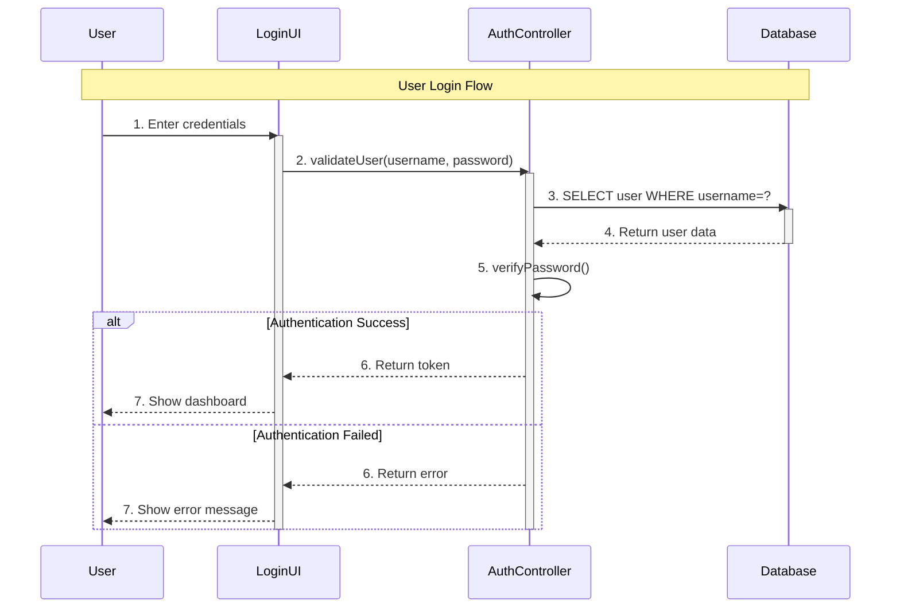

# UML Diagrams

## Table of Contents
- [**Introduction**](#introduction)
- [**Class Diagram**](#class-diagram)
- [**Sequence Diagram**](#sequence-diagram)

### Introduction
- UML diagram is representing all the entities, interfaces, methods in the application and the flow of data between them in. the form of a diagram.
- **Types of UML Diagrams:**
    - **Structural (Static):** 
        - It represents the structure (components) of the application and how they are connected with each other
        - Eg: Class Diagram
    - **Behavioral (Dynamic):**
        - It represents the interaction of the different components.
        - Eg: Sequence Diagram

---

### Class Diagram
- It represents all the classes and their association with other classes in the application.
- ### Representation:
    - **Class:**
        - Create a big rectangle and divide it into 3 parts, the top most will have the class name, the second will have all the characteristics or variables in the format: `variable_name: data_type` and the last will have the methods
        - ```bash
            <<abstract>> (if the class is abstract)
            ---------------------------------------
            |              CLASS NAME              |
            |--------------------------------------|
            |                                      |
            |                                      |
            |       Characteristics/Variables      |
            |                                      |
            |                                      |
            |--------------------------------------|
            |                                      |
            |                Methods               |
            |--------------------------------------|
          ```

    - **Associations:**
        - Connection of classes to represent the relationship between classes.
        - **Types of association:**
            - **Class Association (Inheritence)**
            - **Object Association (Simple, Aggregation, Composition)**

---

### Sequence Diagram

### Key Components

### 1. **Object/Participant**
Represents entities that interact in the system.

**Representation:**
```
┌─────────┐
│  Object │
└────┬────┘
     │
```

### 2. **Lifeline**
Vertical dashed line showing object's existence over time.

**Representation:**
```
┌─────────┐
│  Object │
└────┬────┘
     ┆  ← Dashed vertical line
     ┆
     ┆
```

### 3. **Activation Bar (Execution Occurrence)**
Thin rectangle on lifeline showing when object is active/processing.

**Representation:**
```
     ┆
    ┌┴┐  ← Activation bar (object is active)
    │ │
    │ │
    └┬┘
     ┆
```

### 4. **Messages**
Arrows between lifelines showing communication.

**Types:**

| Message Type | Symbol | Description |
|--------------|--------|-------------|
| **Synchronous** | `────►` | Sender waits for response |
| **Asynchronous** | `- - -►` | Sender doesn't wait |
| **Return** | `◄- - -` | Response/return value |
| **Self Call** | Loop back arrow | Object calls itself |

### 5. **Destroy**
X mark at end of lifeline indicating object destruction.

**Representation:**
```
     ┆
     X  ← Object destroyed
```

---

## Complete Example: User Login System


---

## Text-Based Version (ASCII)
```
User        LoginUI      AuthController    Database
  │             │                │              │
  │──1.login──► │                │              │
  │             │                │              │
  │             ├───2.validate──►│              │
  │             │               ┌┴┐             │
  │             │               │ │──3.query──► │
  │             │               │ │            ┌┴┐
  │             │               │ │◄──4.data───│ │
  │             │               │ │            └┬┘
  │             │               │ │             │
  │             │               │5│ verify()    │
  │             │               │ │             │
  │             │               └┬┘             │
  │             │◄──6.token───── │              │
  │             │                │              │
  │◄─7.success─-┤                │              │
  │             │                │              │
  
  ┌┴┐ = Activation bar (object is processing)
  ──► = Synchronous message (solid arrow)
  ◄── = Return message (dashed arrow)
```

**Components in this example:**
- **4 Participants**: User, LoginUI, AuthController, Database
- **Lifelines**: Vertical dashed lines for each participant
- **Activation Bars**: Rectangles showing when objects are active
- **Synchronous Messages**: Solid arrows (1, 2, 3)
- **Return Messages**: Dashed arrows (4, 6, 7)
- **Self-call**: Step 5 (AuthController calls itself)
- **Alternative Flow**: Success/Failed paths

---

## Quick Summary

| Component | Visual | Purpose |
|-----------|--------|---------|
| Object | Box at top | Entity in system |
| Lifeline | Vertical dashed line | Object's timeline |
| Activation Bar | Thin rectangle | Active processing |
| Message → | Solid arrow | Synchronous call |
| Return ← | Dashed arrow | Response back |
| Self-call | Loop arrow | Object calls itself |
| Destroy | X mark | Object termination |