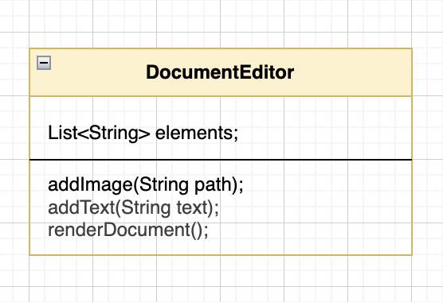

# Design a Document Editor

## Table of Contents
- [**Introduction**](#introduction)
- [**Ways to approach a System design Question**](#ways-to-approach-a-system-design-question)
- [**Bad Design Approach**](#bad-design-approach)

---

### Introduction
- Design a document editer where the users be able to write and store their texts and images. should support text and images for now but should be scalable for documents, tables, fonts, etc.

---

### Ways to approach a System design Question:
- **Top Down:** We start by creating the top most object then we create the smaller sub objects and then decide their association/dependency.
- **Bottom Up:** We start by creating the lowest objects and from them we build upwards creating upper level objects.

---

### Bad Design Approach
- Create a `DocumentEditor` class and add all variables and methods into it

- **Problems with this bad design:**
    - Breaks SCP as the DocumentEditor class has multiple responsibilities.
    - Breaks OCP as we would need to add new methods to incorporate new fonts or new types of 
    
---

### Better Design Approach
- Create separate classes and abstract classes based upon requirements and responsibilities.
