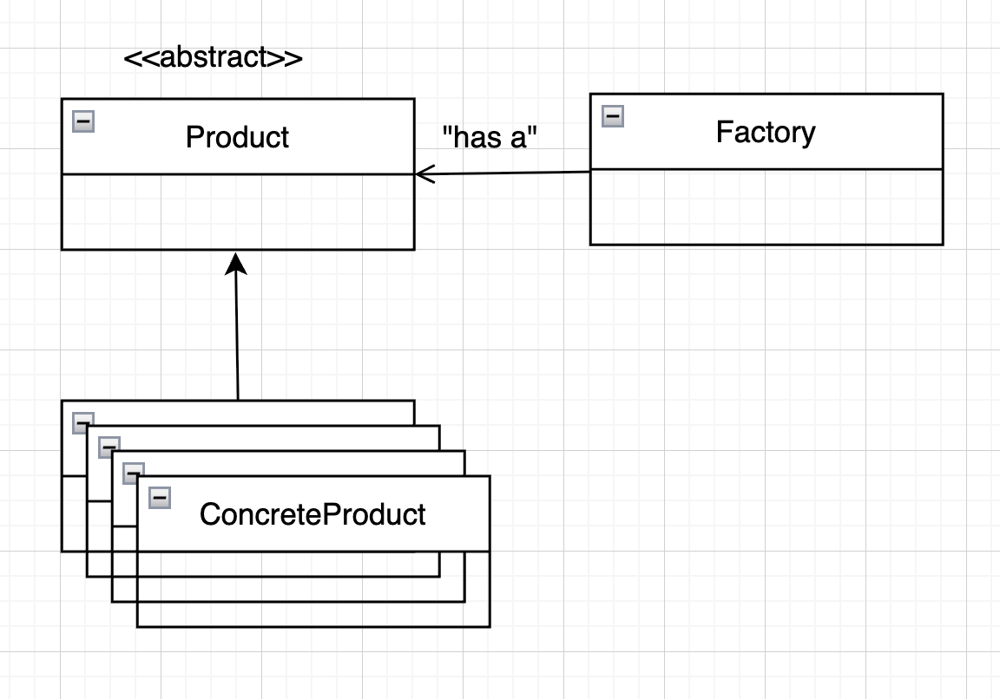
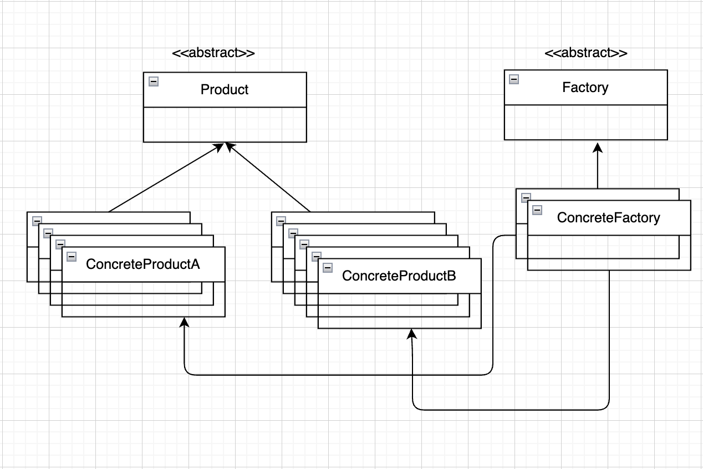
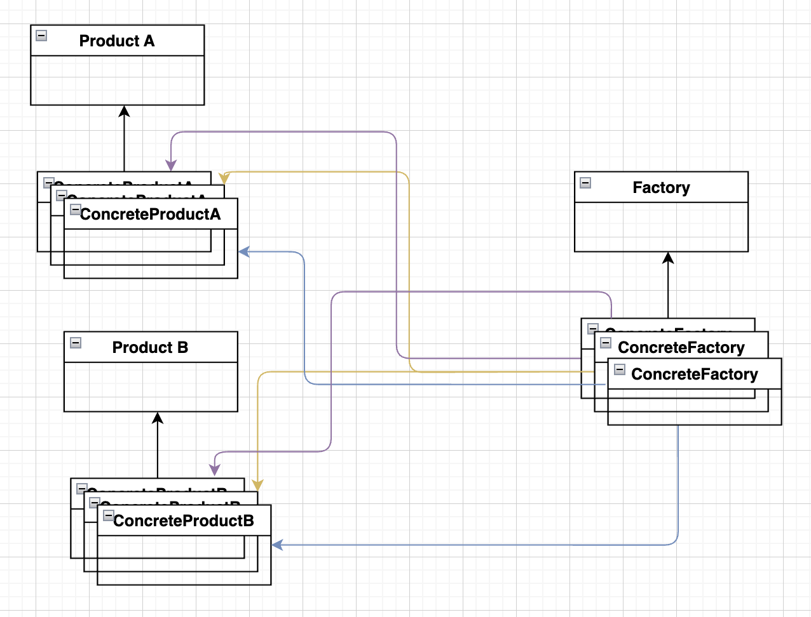

# Factory Design Pattern

## Table of Contents
- [**Introduction**](#introduction)

---

### Introduction
- Factory design patterns emphasizes on abstracting the creation of objects from the client, in other words, the client does not know where or when the object is being created, it just uses it.
- **Types of Factories:**
    - **Simple Factory:**
        - A factory class that decide which concrete class to instantiate.
        - Standard UML diagram:
        
    - **Factory Method:**
        - Defines an interface for creating objects but allows subclass to decide which class to instantiate.
        - Standard UML diagram:
        
    - Abstract Factory Method
        - Provides an interface for creating families of related objects without specifying their concrete classes.
        - Standard UML diagram:
        