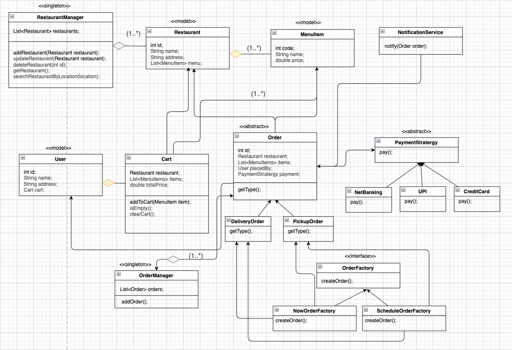

# Design a Food Delivery Application

## Table of Contents
- [**Problem Statement**](#problem-statement)
- [**UML Diagram**](#uml-diagram)
- [**Folder Structure**](#folder-structure)

---

### Problem Statement
- **Functional Requirements:**
    - User can search for restaurants based on location.
    - User can add items to cart.
    - User can checkout by making payment.
    - User should be notified once order placed successfully.

- **Non-Functional Requirements:**
    - Each part of design should be scalable & modifiable.

---

### UML Diagram


---

### Folder Structure
```
OnlineFoodOrderingSystem/
│
├── Main.java                    # Composition root and entry point
├── TomatoApp.java                # Facade class (main orcjavaestrator)
│
├── models/
│   ├── MenuItem.java
│   ├── Restaurant.java
│   ├── User.java
│   ├── Cart.java
│   ├── Order.java                # Abstract Order
│   ├── DeliveryOrder.java
│   ├── PickupOrder.java
│
├── managers/
│   ├── RestaurantManager.java
│   ├── OrderManager.java
│
├── strategies/
│   ├── PaymentStrategy.java      # Base class
│   ├── CreditCardPaymentStrategy.java
│   ├── UpiPaymentStrategy.java
│
├── factories/
│   ├── OrderFactory.java         # Abstract factory
│   ├── NowOrderFactory.java
│   ├── ScheduledOrderFactory.java
│
├── services/
│   └── NotificationService.java
│
├── utils/
│   └── TimeUtils.java
```