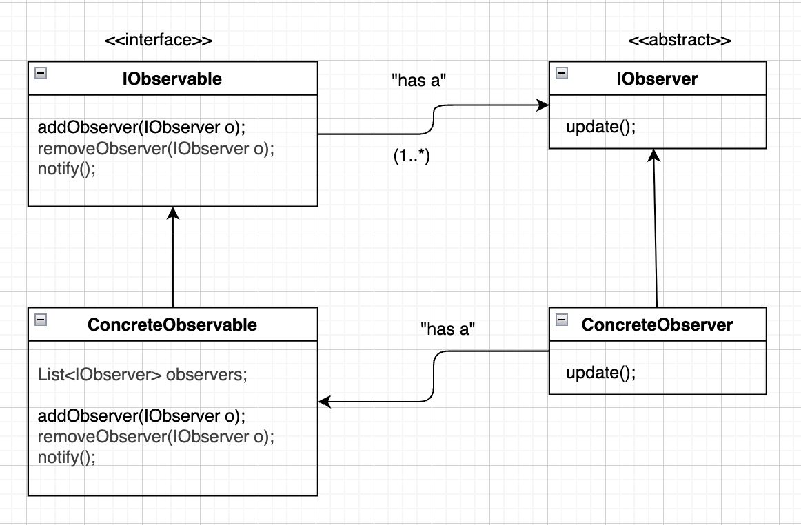

# Observer Design Pattern

### Introduction
- It consists of 2 entities: **Subject** and **Observer**, there are multiple observers but only one subject and the observers wait for any state changes in the subject, whenever the state of the subject changes, its the job of the subject to notify the oberservers.
- It is opposite to polling where the observers continuously poll or keep asking the subject for any changed states.
